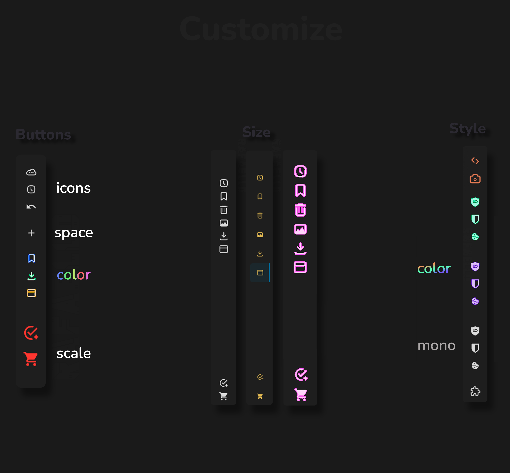
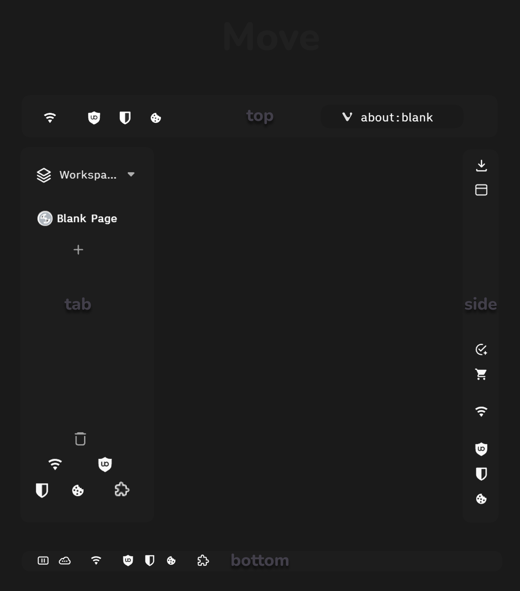
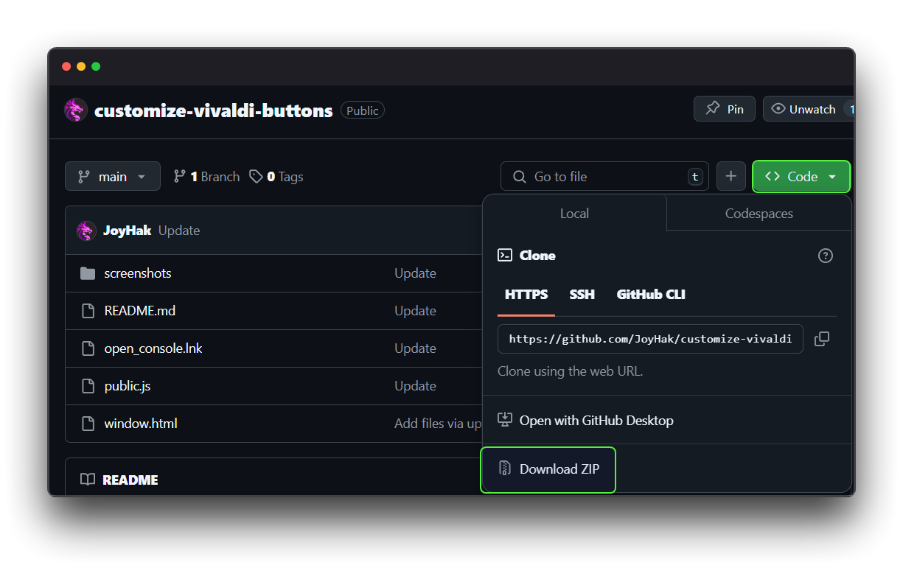
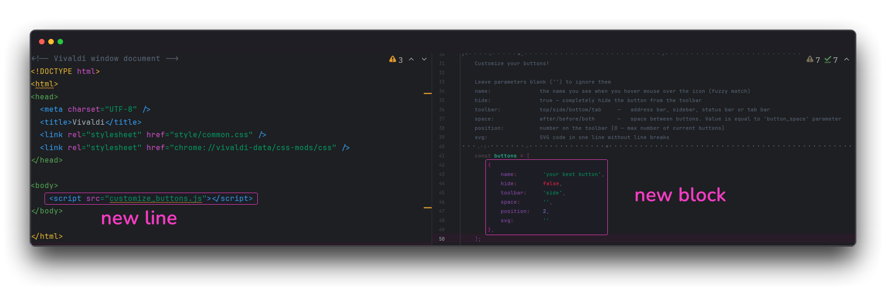
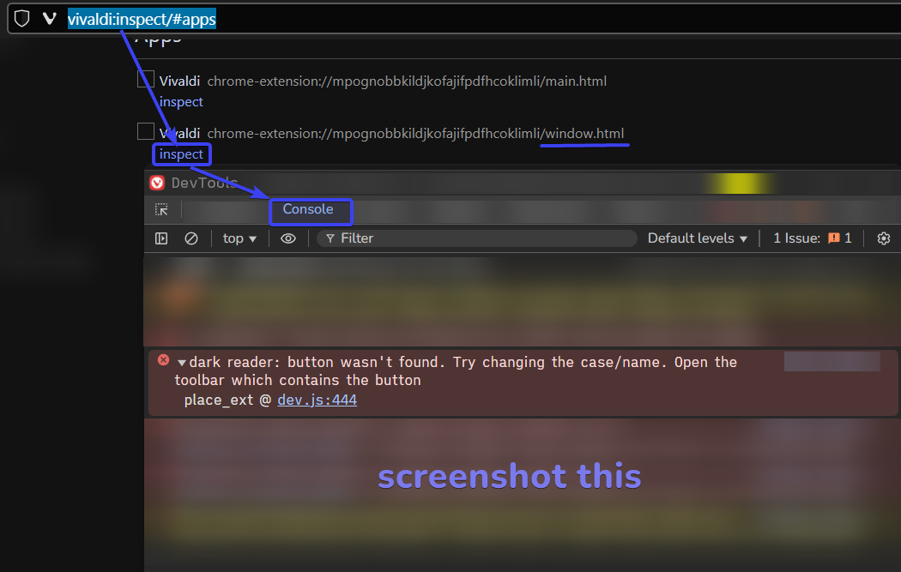
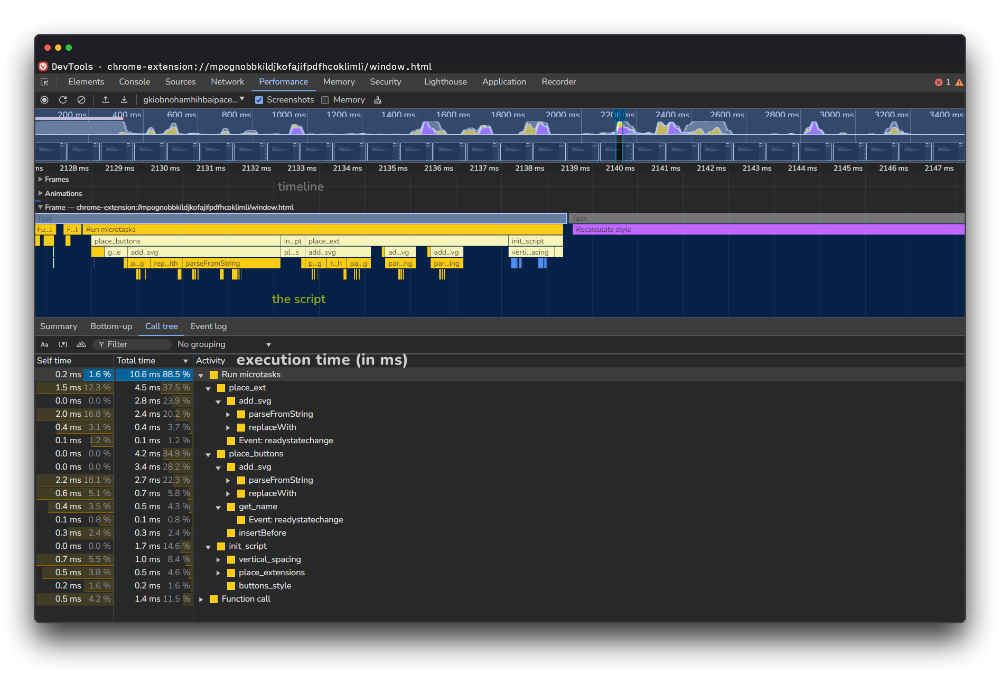
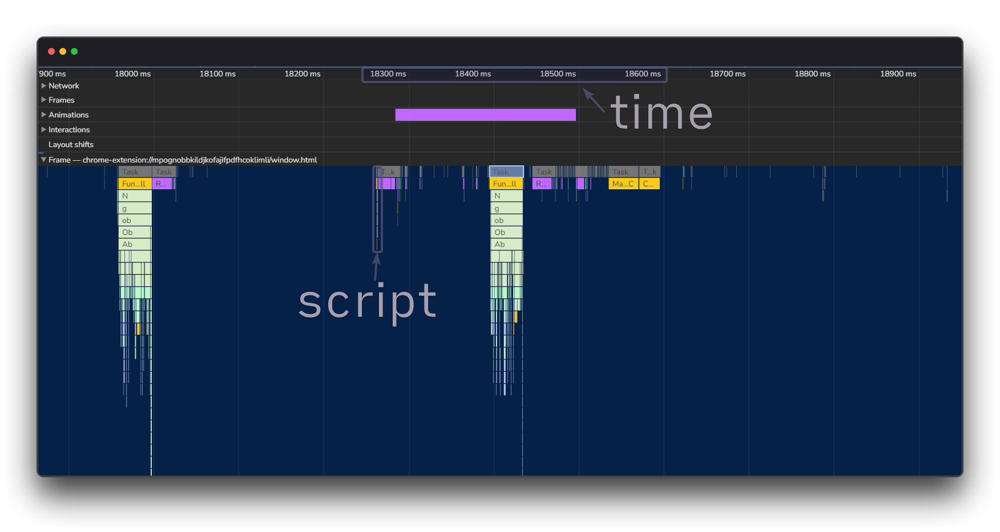

Customize the visible buttons in Vivaldi as you like! Change the position, icons, color, size and make the extension icons truly monochrome! You can place buttons and extensions wherever you like, add or remove spaces, and make the toolbar *compact*, `w i d e` or **HUGE**! 

# Let's get started

1. Download the archive with all the files:
   

2. Go to `C:\Program Files\Vivaldi\Application`

3. Open the *version* folder.

4. Go to `resources\vivaldi`

5. Copy the `window.html`, `public.js` files here and skip next step.

6.  Open the `window.html`. After the element `<body>` add the following line: ``

7. Open the `public.js`. For each button you want to customize, create/copy a code block that should look like this:
   

8. Read the rules on how to work with these parameters. Explore already existing code blocks to better understand what values to enter!

   > Parameters you are not interested in can be blank:  `' '`. The `buttons` config must not contain **extensions**, and the `extensions` config must not contain **buttons**!  

I recommend you use these mods in conjunction with the script:
- https://github.com/JoyHak/Vivaldi-CSS-mods
- https://github.com/quartz1216/vivaldi-gutter

# Icons
Here you can find the SVG code for the icons. Copy it and paste it in quotation marks `' '` in the `svg` parameter:
- https://pictogrammers.com/library/mdi/
- https://icons8.com/icon/set/SVG/
- https://freesvgicons.com
- https://www.flaticon.com

The color can be any, but the script resets it. To change the color, change the `buttons_color` global parameter!

# If you encounter any issues

1. Type `vivaldi:inspect/#apps` in your browser or open `open_console.lnk`.

2. Find the line that contains `window.html`

3. Click `inspect`.

4. Click the `console` tab. Read the errors and fix them in the script.

If something is still not working **after your fixes**, [open the issue](https://github.com/JoyHak/customize-vivaldi-buttons/issues/new/choose) or or go to the [topic on the forum](https://forum.vivaldi.net/post/803412). Don't forget to attach a screenshot and a description of the problem!

# Performance

I optimised not only the speed but also the readability of the script. I documented many optimisation tricks. Customizing 10 normal buttons, changing and moving 4 extensions, changing 4 extensions on another toolbar takes just from 7ms to 11ms: 

I will be glad if you suggest improvements and innovations and find a workaround to the limitations.

# Limitations

- I can't move buttons from invisible panes: e.g. if I close the status bar, I can't move any button from it.

- After adding tabs to the tab bar, the svg icon's height attribute disappears. Fixed by assigning it manually, but it's weird.

- I can't load SVG/PNG icons from disc: I got `fetch error`. Chrome flags and settings do not fix the error. 
- The extensions popup window may go off the screen. To fix this, I need to somehow calculate the position and size of the window relative to the current position of the buttons. 

- I did not set up Mutation observer because of the infinite loop. It generates a change, which triggers mutation observer, which generates a change,... 
I had the idea of assigning a hidden html class to the panel that would tell the observer ‘stop, everything is fine, buttons added’.
- Initialisation of the script can be done via 
`addEventListener(‘DOMContentLoaded’, (event) => {})`, but I haven't tested this feature.
- I haven't figured out how to assign hotkeys to each button. This could fix the issue of non-working extension hotkeys in Vivaldi.
